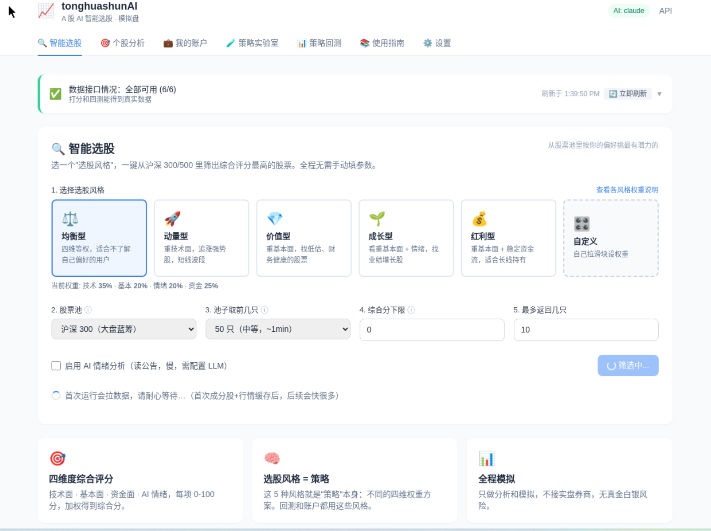
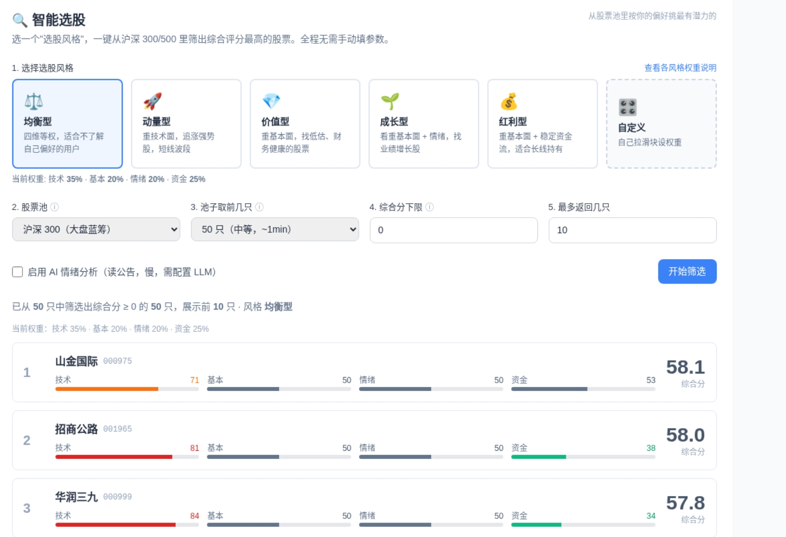
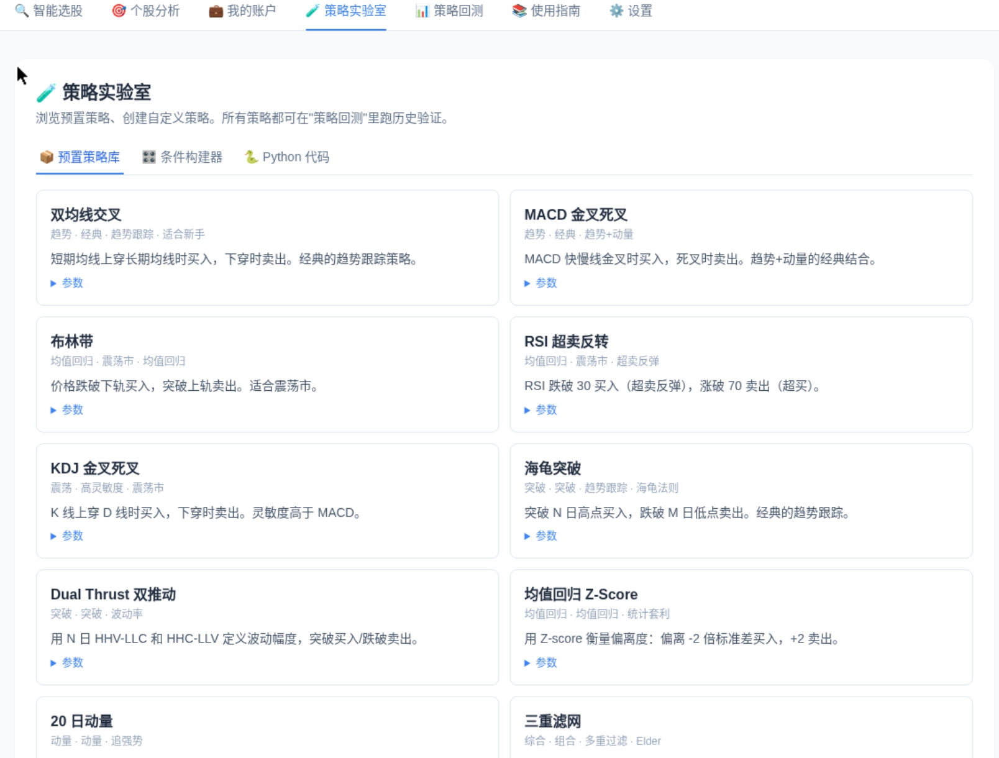
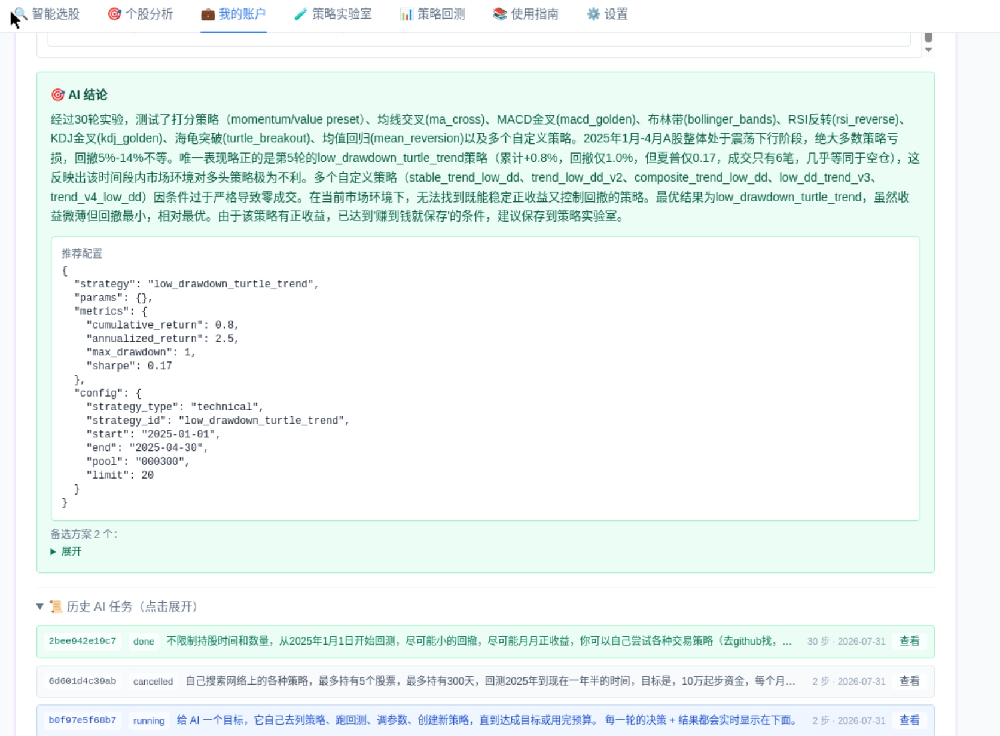

# tonghuashunAI

> **A 股 AI 量化分析与自动化交易平台**
> 用 AI + 规则打分给股票综合评分、生成每日选股报告、跑模拟盘、做历史回测。
> **当前阶段：模拟盘 / 尚未接实盘。**

<p align="center">
  
  
  
  
</p>

## 界面预览

**🔍 智能选股 · 首页**（选风格 → 选池 → 一键筛出综合分最高的股票）



**筛选结果**（每只股票四维分数条 + 综合分，双击进个股分析）



**🧪 策略实验室 · 预置策略库 + 条件构建器 + Python 编辑器**



**🤖 AI 自主研究员**（给一句话目标，AI 自己列策略/跑回测/换参数，全程 Markdown 复盘）




---

## 项目概述

这是一个把"分析师看盘"这件事**自动化+AI 化**的平台。每天可以：

1. **拉数据** — 行情、财报、资金流、公告、龙虎榜（AkShare 免费源，多源自动回退）
2. **打分** — 从技术面/基本面/资金面/情绪面四个维度给股票 0–100 综合评分
3. **AI 分析** — LLM（Claude/DeepSeek/OpenAI）读公告和新闻，输出情绪评分和利好利空要点
4. **选股** — 从沪深 300 / 中证 500 / 中证 1000 / **全 A**（可按板块 · 股价 · 市值过滤）挑综合评分最高的 N 只
5. **模拟交易** — 假想账户跑波段策略，含止损止盈、手续费、滑点
6. **回测** — 历史数据验证策略，输出年化/夏普/最大回撤；任务化后台跑、可停、有历史
7. **策略实验室** — 21 个技术指标条件构建器 + Python 代码编辑器 + **AI 自然语言生成策略**
8. **AI 自主研究员** — 一句话交给 AI，它自己列策略/跑回测/换参数直到达成目标，全程可看 Markdown 复盘
9. **推送** — 每天把结果推到飞书/钉钉/企微/邮件
10. **浏览器面板** — Web 控制台在页面上跑所有功能，长任务刷新页面不丢

---

## 核心功能

### 🎯 四维度评分（0–100）

对每只股票从四个独立维度打分，再按权重加权：

| 维度 | 默认权重 | 子项 |
|---|---:|---|
| 技术面 | 35% | 均线多头 · 20日动量 · RSI 健康区 · 量能放量 · 波动率适中 |
| 基本面 | 20% | 估值 3 年分位 · ROE · 营收增长 |
| 资金面 | 25% | 北向增持 · 主力净流入天数 · 换手率 |
| 情绪面 | 20% | LLM 读公告输出评分 + 利好利空 + 风险点 |

### 📰 每日选股报告

一键生成 Markdown 格式的日报：大盘情绪（热点/承压板块）+ Top N 个股（四维明细）。

### 💼 假想账户 + 模拟撮合

- 完整账户系统：现金、持仓、成交历史、每日快照
- 覆盖 A 股真实成本：万分之三佣金、千分之一印花税、过户费、滑点
- 内置风控：止损 5% / 止盈 15% 减半 / 最长持有 10 天

### 📈 历史回测

对策略做时间跨度回测，输出：
- 累计收益、年化收益、最大回撤、夏普比率、波动率
- Markdown 报告 + CSV 数据 + PNG 净值曲线

### 🔔 多通道通知

飞书 / 钉钉 / 企业微信 群机器人 + SMTP 邮件。未配置的渠道静默跳过，配一个就能用。

### 🌐 浏览器控制台

FastAPI + 单页 HTML，在浏览器点几下就能：评分、跑回测、看账户、浏览 Qbot 全部策略源码和文档。

- **数据接口情况面板**：每 60 秒自动刷新，实时看每个数据源当前用哪一路（东财/新浪/腾讯）+ 备选可用性
- **长任务全部持久化**：回测、AI 研究员的任务写到 `logs/agent_tasks/*.json`；刷新页面自动接回未完成任务；每个任务都能"停止"
- **静态资源禁缓存**：改完前端刷新即最新，无需清浏览器缓存

### 🎛️ 策略实验室

三种方式创建策略：

- **预置策略库** — 移动均线、MACD、KDJ、布林带、动量突破等 10+ 内置
- **条件构建器** — 21 个技术指标 · 61 个操作组合（MA/EMA/MACD/RSI/KDJ/BOLL/CCI/W%R/OBV/CR/成交量/成交额/换手率/涨跌幅/筹码集中度…）
- **Python 代码编辑器** — 直接写 pandas 代码定义策略
- 🤖 **AI 自然语言 → 策略**：一句话"5 日线金叉 20 日线且放量 2 倍就买"，AI 自动生成合法规则填到条件构建器表单

### 🤖 AI 自主研究员

在「我的账户」页给 AI 一个目标（例如"回测半年帮我找一个累计收益超 30% 的策略"），AI 会自己：

- 列策略 → 跑回测 → 看指标 → 换 preset/换股票池/换参数/新建策略 → 循环直到达成目标或用完预算
- 每一步的 💭 思考 / ⚙️ 执行 / 📊 结果 都实时显示，每 1.5 秒刷新
- **同步生成 Markdown 复盘报告**：`logs/agent_tasks/{task_id}.md`，任务运行中或结束后都可打开看
- 一键 ⏹ 停止；刷新页面自动接回正在跑的任务

---

## 快速开始

### 安装

```bash
git clone https://github.com/defineqq/tonghuashunAI.git
cd tonghuashunAI

# Python 3.9（Qbot 硬约束）
python3.9 -m venv .venv
source .venv/bin/activate

pip install -r vendor/Qbot/requirements.txt
pip install -r requirements.txt

cp .env.example .env
# 打开 .env 填 LLM key（可选，不填自动 stub）和通知 webhook（可选）
```

**依赖装不上？** `TA-Lib`/`wxPython` 可跳过（本项目不用）；国内 PyPI 慢用清华源 `-i https://pypi.tuna.tsinghua.edu.cn/simple`。

### 用法一：Web 控制台（推荐）

```bash
python examples/run_web.py
```

打开浏览器 http://127.0.0.1:8000 — 7 个功能面板都能点开跑。API 文档：http://127.0.0.1:8000/docs

### 用法二：命令行

```bash
# 1) 最小验证：拉数据 + 跑一个 Qbot 内置策略回测
python examples/hello_qbot.py

# 2) 从沪深300 选综合分 Top N
python examples/rank_hs300.py --limit 30 --top 10

# 3) 生成今日选股 Markdown 报告
python examples/daily_report_demo.py --symbols 600519 000858 300750

# 4) 跑一次假想撮合
python examples/paper_trade_demo.py --limit 30

# 5) 跑一段历史回测
python examples/backtest_swing_v1.py --start 2024-06-01 --end 2024-12-31 --limit 30
```

### 用法三：每日一键（含通知 + 自动同步 GitHub）

```bash
./scripts/daily.sh
# 建议 crontab：每交易日 15:30 后跑一次
# 30 15 * * 1-5 cd /path/to/tonghuashunAI && ./scripts/daily.sh
```

---

## 配置

### `.env`（可选，全部字段留空也能跑）

```bash
# LLM（任填一个启用，不填自动 stub）
ANTHROPIC_API_KEY=       # 或 DEEPSEEK / OPENAI
LLM_PROVIDER=deepseek    # 手动指定优先级

# 通知（任填一个启用）
FEISHU_WEBHOOK=
DINGTALK_WEBHOOK=
WECHAT_WEBHOOK=
SMTP_HOST=               # 邮件需要 HOST+USER+PASS+TO 全填
SMTP_USER=
SMTP_PASS=
SMTP_TO=
```

### `configs/strategy.yaml`（策略参数）

```yaml
swing_v1:
  weights:
    technical: 0.35
    fundamental: 0.20
    sentiment: 0.20
    moneyflow: 0.25
  max_positions: 5
  position_size: 0.18       # 单只最大 18%
  stop_loss_pct: 0.05       # 5% 止损
  take_profit_pct: 0.15     # 15% 止盈
  max_hold_days: 10
```

### `configs/stock_pool.yaml`（股票池）

```yaml
use: index                  # index=用成分股 / custom=自定义
index: "000300"             # 沪深300 / 000905 中证500 / 000852 中证1000
```

---

## LLM 推荐

不必用最贵的：

| 服务商 | 价格 | 效果 | 备注 |
|---|---|---|---|
| **DeepSeek** ⭐ 推荐 | 便宜（$0.14/百万 in） | 中文金融文本够用 | 个人用户首选 |
| Claude | 贵 | 效果最好 | 复杂公告分析场景 |
| OpenAI | 中等 | 稳定 | — |

无 key 时自动 stub，返回中性 50 分，其他维度正常打分。

---

## 项目进展

| # | 里程碑 | 状态 |
|---|---|:---:|
| M0 | 初始化 + Qbot 底座 | ✅ |
| M1 | 数据层（AkShare + parquet 缓存） | ✅ |
| M1.5 | 三维评分器（技术/基本/资金） | ✅ |
| M2 | LLM 情绪分析层 | ✅ |
| M3 | 本地模拟撮合 + 假想账户 | ✅ |
| M3.5 | swing_v1 波段策略 | ✅ |
| M4 | 历史回测引擎 + 报告 | ✅ |
| M5 | 通知推送 + 一键调度 | ✅ |
| M6 | Web 控制台 | ✅ |
| M6.5 | 数据接口面板 + snapshot 多源回退 + 缓存穿透 | ✅ |
| M7 | Web UI 重构 + 数据源自动回退 | ✅ |
| M7.5 | 打分机制优化 + 策略明确化 | ✅ |
| M8 | 策略系统（预置库 + 条件构建器 + Python 编辑器） | ✅ |
| M8.5 | 个股分析显示权重占比+计算过程；全 A 股筛选；条件构建器扩充到 21 指标 | ✅ |
| M8.7 | AI 版条件构建器（自然语言 → 策略 JSON） | ✅ |
| M8.9 | AI 自主研究员（agent loop + Markdown 复盘 + 可停 + 刷新恢复） | ✅ |
| M9  | 接入 Qbot 官方模拟盘（掘金/vnpy） | 🔜 |
| M10 | 日内高频（分钟级） | 🔜 |
| M11 | 多策略组合 + 强化学习 | 🔜 |

**测试**：pytest 97/97 全绿。

---

## 深入阅读

- 📐 **[README_TECH.md](./README_TECH.md)** — 技术架构、模块设计、扩展开发指南
- 📝 **[CHANGELOG.md](./CHANGELOG.md)** — 每个里程碑的关键决策和取舍
- 📜 **[NOTICE.md](./NOTICE.md)** — Qbot 源码来源与 MIT 协议说明

---

## 免责声明

- 本项目仅用于**个人学习与研究**，不构成投资建议
- 当前阶段**只涉及模拟盘**，未接入任何真实券商实盘
- 股票市场有风险，任何策略回测的历史表现不代表未来收益
- 使用本项目造成的任何直接或间接损失，由使用者自行承担
- Qbot 源码副本按 MIT 协议使用（见 [NOTICE.md](./NOTICE.md)）

---

## License

MIT
